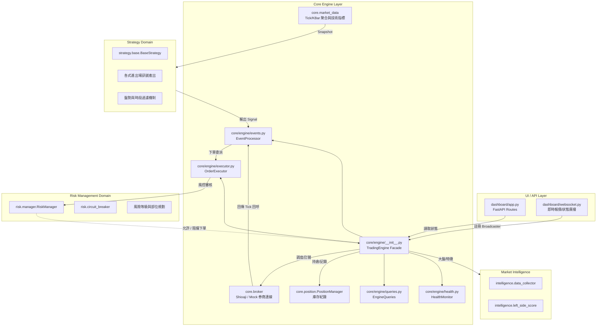

# UltraTrader 專案架構與核心模組分析

本文件旨在幫助新接手的開發者，從高階視角快速理解 `UltraTrader` 專案的定位、目錄結構、核心模組與系統生命週期。

---

## 1. 專案定位、解決問題及主要功能

- **專案定位**：`UltraTrader` 是一個開源的台灣期貨自動化交易系統（主要針對微台等商品）。透過純本地部署方案，提供「免綁定雲端」的演算法交易解決方案。
- **解決問題**：解決過往交易者在面對盤中劇烈波動時帶來的「情緒化下單」與「風險控管不力」問題；透過內建自動回測、動態調整策略以及嚴格的軟性/硬性熔斷機制，打造一致性高的獲利循環。
- **主要功能**：
  - **自動交易與多時框策略**：內建自適應動量、均值回歸等策略。
  - **全面的風險管理**：最大回撤保護、連虧熔斷、Kelly 動態倉位計算。
  - **即時儀表板**：在地端提供 Web UI，隨時監視策略狀況、未平倉部位。
  - **多模式運行**：支援 Local Simulation、永豐報價沙盒模擬 (Paper) 與實盤交易 (Live)。
- **使用對象**：熟悉的 Python 的量化交易員 (Quant)、技術投資客或獨立研究者。

---

## 2. 專案整體目錄設計

本專案將業務邏輯依照領域驅動觀念切分，核心代碼收斂明顯：

- `core/` **(核心業務)**：交易引擎（Engine）、券商連線（Broker）、市場報價聚合（Market Data）與部位追蹤（Position）。
- `strategy/` **(核心業務)**：各類交易策略計算與指標產生器，負責決定「何時買賣」。包含市場盤勢分類器。
- `risk/` **(核心業務)**：風控審核模組。包含各層級熔斷器（Circuit Breaker）與部位規模計算（Position Sizing）。
- `intelligence/` **(分析模組)**：大數據與特徵採集（Data Collector）及左側交易等預測分析腳本。
- `dashboard/` **(使用者介面)**：以 FastAPI 實作的 Web Server 與 WebSocket，用來推送前端 UI 需要的數據。
- `backtest/` **(離線基礎設施)**：提供回放歷史 K 線等歷史回測引擎與報表產出。
- `tests/` **(測試)**：專案的單元 / 整合測試目錄。
- `scripts/` **(啟動/維運腳本)**：包含對外啟動點 `start.py` 以及回測用的執行入口腳本。
- `data/` **(檔案資料/基礎設施)**：存放歷史報價、Log 檔案及產出的回測報表（通常被 `.gitignore` 忽略）。

---

## 3. 核心模組與責任邊界 (模組結構圖)

為了確保測試隔離、方便 AI Agent 或團隊成員擴充，系統的核心架構維持明確的單向信號流動。

### 模組邊界與職責定義

- **TradingEngine (`core/engine/__init__.py`)**：全域協調器（Facade）。負責初始化 Broker/風控/管線與子系統，並提供穩定的 public API（`start/stop/pause/resume/get_state/toggle_auto_trade/set_risk_profile`）。
- **EventProcessor (`core/engine/events.py`)**：事件分派與策略決策路由。接收 Tick/KBar 事件、更新指標快照、廣播資料，並在需要時委派進出場給 `OrderExecutor`。
- **OrderExecutor (`core/engine/executor.py`)**：下單與持倉寫入的唯一入口。包含冷卻機制、paper/live 路徑差異、以及風控評估呼叫。
- **EngineQueries (`core/engine/queries.py`)**：狀態查詢聚合（供 Dashboard/API 使用），避免 UI 直接耦合引擎內部結構。
- **HealthMonitor (`core/engine/health.py`)**：心跳與異常偵測（包含持倉核對）。
- **Strategy (`strategy.*`)**：純業務邏輯層。輸入 `MarketSnapshot`，輸出統一的 `Signal`。此層無外部環境依賴，極度適合進行 mock 與自動化單元測試。
- **Risk (`risk.*`)**：純控管邏輯。只根據可用資金、連續虧損次數與目前傳入訊息進行把關，不具有下單權限。
- **Broker (`core.broker`)**：隔離外部變動的 Adapter。提供統一介面 `place_order`，隔離了實體 Shioaji API 或內部 Mock 生態。

---

## 4. 系統啟動與資料流向

### 初始化流向 (以 `scripts/start.py` 為起點)
1. **環境檢查**：讀取 `.env` 確認當下為 `simulation` / `paper` / `live` 模式，載入風險等級參數。
2. **實例構造**：實例化 `TradingEngine`。TradingEngine 內部根據商品清單建立 `InstrumentPipeline`。
3. **券商連接**：啟動 `MockBroker` 或是真正的 `ShioajiBroker`，並在 live 模式同步真實持倉以還原 `PositionManager` 狀態。
4. **前端伺服器掛載**：利用 FastAPI 建構 API (`dashboard/app.py`) 並將 Engine 掛載進入背景。最終利用 `uvicorn` 提供 HTTP 服務。

### 交易資料流與執行迴圈
整個系統依循強烈的 **Event-Driven (事件驅動)** 設計：
1. `Broker` 透過 WebSockets 或模擬器產生 `Tick` 報價回呼。
2. `EventProcessor.on_tick` 將事件放入 Thread-Safe 的 `queue.Queue`（為確保時序與避免併發競爭）。
3. `EventProcessor._engine_loop` 巡迴取出事件並分派（tick / kbar）。
   - **檢查硬停損**：比對現在價格與保護性價格，觸及則強平。
   - **技術聚合**：傳遞至 `TickAggregator` 更新 K 線圖，接著交給 `IndicatorEngine` 計算均線等特徵。
   - **策略產生**：將組裝好的市場快照交由 `Strategy.check_exit` 或 `check_entry` 分析，若達到閾值則觸發交易信號。
   - **風險攔截**：將信號呈遞給 `RiskManager`，評估虧損次數、最大回撤等。若攔截器放行，呼叫 `Broker.place_order` 並儲存至 `PositionManager`。
   - **即時廣播**：透過 `_broadcast` 將更新經由 WebSocket 推播至前端 Dashboard 進行渲染。

---

## 5. 技術棧與用途依據

依照專案宣告與 `requirements.txt`：

| 技術名稱 | 用途說明 |
|--|--|
| **Python 3.10+** | 專案主要開發語言（依據 `start.py` 中的 runtime 驗證推測）。 |
| **Shioaji** | 永豐金證券提供的官方 Python API 套件，負責實盤及模擬盤報價/委託對接。 |
| **FastAPI + Uvicorn** | 建置快速且非同步的在地端網頁應用系統服務器，作為 Dashboard 前端與後端分離的支撐。 |
| **WebSockets** | 建構 Browser 與伺服器間的高更新頻率連線，用以每秒推送行情 Tick 報價和引擎狀態。 |
| **Pandas / NumPy** | 提供時間序列技術指標的運算結構 (`IndicatorEngine` 與左側分析)。 |
| **Loguru**| 強大的日誌追蹤，支援 Concurrent 異步寫入與 Log Rotation。 |
| **yFinance** | 用於背景或策略爬取大盤與國際商品對應參考指數（推測）。 |

---

## 6. 額外補充架構洞查

根據源碼研讀，彙整出現行系統的工程特徵：

- **API 路由設計**：未在此專案找到厚重的 Controller，推測大量 REST Endpoints 都集中在 `dashboard/app.py` 中，透過 Router 對 Engine 發送命令（例如 `/api/start`）。
- **狀態管理方式**：集中管理在 `TradingEngine` 記憶體空間內。重啟系統時，靠 `Broker` 反查券商API的留倉 `get_real_positions`，來動態復原持倉狀態（見 live 模組）。
- **資料庫存取層**：**未在目前檔案中明確發現** RDBMS（如 MySQL）/ NoSQL（如 Redis）。從程式碼判斷歷史K線與回測紀錄主要存放於 `data/` 下的文件 (`.json`, `.csv`)。
- **任務排程或背景工作**：系統大量使用 `threading.Thread` 與 `queue.Queue`，結合自帶的心跳機制 `_heartbeat` 替代傳統排程器（Celery/Cron）。
- **訊息佇列或事件機制**：交易核心採取 Python 內建的 `queue.Queue` 作為單點 In-Memory Event Bus，將非同步 Tick 封閉在單一執行緒解析，安全分離了報價源頭與資料處理。無引用外部 MQ。
- **權限驗證與設定管理**：由 `.env` 或 `os.environ` 決定安全性 API Token。無使用者的 Auth 機制登入，因設計上是單人生態 (Single User / Local deployment)。
- **Docker / CI/CD 部署**：**未在目前檔案中明確發現**。符合專案的宣告目標：「Zero cloud dependencies. Runs entirely on your machine.」，因此不強需這類雲端自動化流程。
