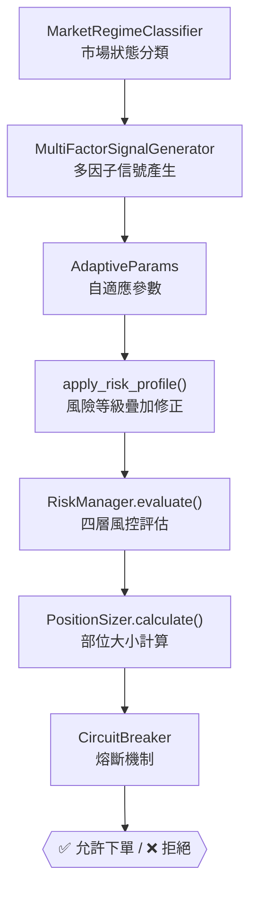

# UltraTrader 四級風險策略深度分析與優化建議

## 一、系統架構總覽

UltraTrader 的交易決策流程由三個核心層級交互控制：



風險等級（conservative / balanced / aggressive / crisis）同時影響**三個獨立子系統**：
1. **策略層** — `AdaptiveParams.apply_risk_profile()` → 改變進場門檻、停損寬度、追蹤停利觸發點
2. **風控層** — `RiskPreset` → 改變單筆風險比例、每日上限、熔斷參數
3. **出場層** — 透過 `AdaptiveParams` 間接影響 Chandelier Exit、時間停損、冷卻期

---

## 二、四級風險等級詳細參數對比

### 2.1 策略層參數（`AdaptiveParams.apply_risk_profile()`）

以「正常市場 `atr_ratio=1.0`、`RANGING` 以外的趨勢狀態」為基準，計算各等級實際生效值：

| 參數 | 🛡️ 保守 | ⚖️ 平衡 | 🔥 積極 | ⚔️ 危機 |
|:---|:---:|:---:|:---:|:---:|
| **停損倍數** (SL × ATR) | 2.0 | 2.5 | 3.25 | 4.5 |
| **進場門檻** (min_signal) | 0.69 | 0.60 | 0.51 | ≤0.55 (clamp) |
| **追蹤停利觸發** (ATR 倍數) | 1.2 | 2.0 | 2.6 | 4.0 (clamp) |
| **追蹤距離** (ATR 倍數) | 0.8 | 1.0 | 1.0 | 1.5 |
| **時間停損** (K 棒數) | 60 | 60 | 60 | 60 (clamp) |
| **冷卻期** (K 棒數) | 10 | 3 | 1 | 15 |
| **滑價預估** (ticks) | 2 | 2 | 2 | 2 |

> [!NOTE]
> `balanced` 等級不做任何修正，直接使用 `AdaptiveParams.update()` 的原始自適應值。
> 所有參數在 `apply_risk_profile()` 最後進行邊界 clamp，防止疊加後偏離合理範圍。

### 2.2 風控層參數（`RiskPreset`）

| 參數 | 🛡️ 保守 | ⚖️ 平衡 | 🔥 積極 | ⚔️ 危機 |
|:---|:---:|:---:|:---:|:---:|
| **單筆風險** (佔帳戶比例) | 3% | 4% | 6% | 8% |
| **最大口數** | 1 | 1 | 2 | 2 |
| **每日交易上限** | 5 | 10 | 20 | 20 |
| **每日虧損上限** (元) | 2,000 | 3,000 | 4,000 | 5,000 |
| **連續虧損暫停** | 3 筆 | 4 筆 | 5 筆 | 5 筆 |
| **冷卻時間** (分鐘) | 30 | 15 | 10 | 5 |
| **最大回撤** (佔帳戶) | 5% | 6% | 8% | 12% |

### 2.3 熔斷機制（`CircuitBreaker`）

所有等級共享同一個四條件觸發機制：

| 條件 | 觸發門檻 | 結果 |
|:---|:---|:---|
| 每日虧損超限 | `daily_loss >= max_daily_loss` | **HALTED**（當日停機） |
| 連續虧損 N 筆 | `consecutive_losses >= max_consecutive_loss` | **COOLDOWN**（冷卻 M 分鐘） |
| 短時間過多交易 | 10 分鐘內 ≥ 5 筆 | **COOLDOWN** |
| 單筆異常虧損 | `abs(pnl) > expected_max_loss × 2` | **EMERGENCY_STOP**（需手動恢復） |

---

## 三、進場邏輯分析

### 3.1 多因子信號系統（8 因子加權）

| 因子 | 權重 | 評分邏輯 |
|:---|:---:|:---|
| 趨勢方向 | 20% | 價格 vs EMA20 + EMA5/10/20/60 排列 |
| RSI 動量 | 15% | RSI 值 + RSI MA5/MA10 趨勢（左側偏好極端值） |
| K 線型態 | 15% | 長影線、吞噬型態 + 放量確認 |
| 成交量 | 12% | volume_ratio（< 1.0 直接 0 分） |
| 多時框確認 | 12% | 5m / 15m EMA5 vs EMA20 方向一致性 |
| 突破確認 | 10% | 價格突破近期高/低點（以 ATR 為尺度） |
| ADX 強度 | 8% | ADX 值（< 20 幾乎 0 分） |
| 波動率 | 8% | ATR ratio 0.8~1.3 滿分，異常值低分 |

### 3.2 進場前置過濾（依序檢查，任一不通過則不產生信號）

```
1. 盤別檢查 → 收盤前 30 分鐘不開新倉
2. 市場狀態 → RANGING / VOLATILE → 不交易
3. 冷卻期 → 停損後等待 N 根 K 棒
4. 200MA 濾鏡 → 不做逆勢單（價格在 200MA 錯誤側）
5. ADX < 25 → 趨勢不明確，不進場
6. 信號強度 < min_signal_strength → 不進場
7. 開盤波動期 → 額外 +0.10 門檻
```

### 3.3 危機模式特殊邏輯

| 模式 | 觸發條件 | 交易策略 |
|:---|:---|:---|
| **CRISIS_DOWN** | 5 因子中 ≥ 3 個觸發（VIX>30、VIX ROC>30%、ATR 翻倍、P/C>1.5、外資賣超>300億） | 跟勢做空，7x ATR 停損，10x ATR 停利 |
| **CRISIS_REVERSAL** | 危機中 + 左側評分>0.5 + P/C>2.0 + VIX>35 + strong_buy 訊號（≥2） | 左側做多，4x ATR 停損，8x ATR 停利 |

---

## 四、出場邏輯分析（七層保護系統）

從 `AdaptiveMomentumStrategy.check_exit()` 分析，出場機制按優先級排列：

| 層級 | 名稱 | 觸發條件 | 風險等級影響 |
|:---|:---|:---|:---|
| **第 0 層** | 盤別強制平倉 | 收盤前 5 分鐘 | ❌ 無（所有等級一樣） |
| **第 1 層** | 固定停損 + 自適應收緊 | 價格觸及 SL，且 ATR 縮小時 SL 自動上移 | ✅ SL 倍數受等級影響 |
| **第 1.5 層** | 保本停損 | 獲利 > 2x ATR → SL 移至進場價 + 0.5 ATR | ❌ 固定 2x ATR 門檻 |
| **第 2 層** | Chandelier Exit | 獲利 > trailing_trigger → 追蹤最高點回撤 | ✅ trigger 和 distance 受等級影響 |
| **第 2.5 層** | 利潤回吐保護 | 最大未實現獲利 > 2x ATR 且回吐 > 35% | ❌ 固定 35% |
| **第 3 層** | 分段停利 | 價格觸及 TP level（1/3 + 1/3 + 1/3） | ✅ TP levels 由 SL 倍數衍生 |
| **第 4 層** | 時間停損 | 持倉 > N 根 K 棒且仍在虧損 | ✅ time_stop_bars 受等級影響 |

---

## 五、現有問題與風險評估

### 5.1 🔴 高風險問題

> [!CAUTION]
> **危機模式繞過了正常的多因子系統**。`_crisis_short_signal()` 和 `_crisis_reversal_signal()` 使用硬編碼的 strength 值（0.6~0.95），不經過 8 因子評分。這意味著在危機模式中，成交量、多時框確認等關鍵因子被完全跳過。

> [!WARNING]
> **保守模式的進場門檻可能被 clamp 壓到無效**。`min_signal_strength` 在 `apply_risk_profile("conservative")` 中乘以 1.15 後約為 0.69，但 clamp 上限是 0.90。在強趨勢下額外 ×0.85 又降到 0.59，使得保守模式在強趨勢中的門檻反而低於預期。

> [!WARNING]
> **`crisis` 模式的 12% 最大回撤過於激進**。以 43K 帳戶計算，`12% = 5,160 元`，但 `max_daily_loss = 5,000 元`。這意味著一天的虧損幾乎就能打到最大回撤限制，而回撤檢查用的是「帳戶峰值」而非「當日起點」，實際上回撤保護幾乎形同虛設。

### 5.2 🟡 設計缺陷

1. **分段停利無法真正執行**：程式碼中 `Signal.strength = fraction` 表示出場比例，但 `_force_close()` 和 `place_order()` 實際上都是全部平倉 — 代碼中沒有局部平倉的實作。
2. **相關性風控過於簡化**：`_check_correlation()` 只看「同方向」就一律減半，沒有考慮商品實際相關係數（TMF vs TGF 在正常市可能低相關，危機時才高相關）。
3. **保本停損門檻固定為 2x ATR**：不受風險等級影響。保守模式理應更早啟動保本（例如 1.5x ATR），積極模式可以晚一些。
4. **利潤回吐保護比例固定 35%**：保守模式應更嚴格（如 25%），積極模式可更寬鬆（如 50%）。

### 5.3 🟢 設計亮點

1. **自適應參數 EMA 平滑**：避免了參數在不同市場狀態間的離散跳變，這是專業級設計。
2. **Chandelier Exit**：用當前 ATR 而非進場時 ATR 計算追蹤距離，能動態適應波動率變化。
3. **多層熔斷**：四條件觸發 + 自動日重置 + 手動恢復，結構完整。
4. **盤別感知**：開盤波動期提高門檻、收盤前限制開倉，符合台指期實際特性。

---

## 六、優化方向建議

### 6.1 短期優化（低風險，立即可做）

| 項目 | 說明 | 影響範圍 |
|:---|:---|:---|
| **保本停損門檻依風險等級調整** | conservative=1.5x, balanced=2.0x, aggressive=2.5x, crisis=3.0x | `momentum.py` 第 289 行 |
| **利潤回吐保護比例依風險等級調整** | conservative=25%, balanced=35%, aggressive=50%, crisis=50% | `momentum.py` 第 352 行 |
| **修正保守模式強趨勢門檻降低問題** | 強趨勢 ×0.85 修正應在 `apply_risk_profile` 之後做 clamp，或保守模式不享受此優惠 | `signals.py` 第 84-86 行 |
| **危機模式加入成交量確認** | `_crisis_short_signal()` 至少檢查 `volume_ratio >= 1.0`，避免量縮假跌 | `momentum.py` 第 123-173 行 |

### 6.2 中期優化（需要回測驗證）

| 項目 | 說明 | 預期效果 |
|:---|:---|:---|
| **動態相關性係數** | 用滑動窗口（20 根 K 棒）計算 TMF-TGF 真實相關係數，相關 > 0.7 才降倉 | 減少不必要的降倉，提升多商品收益 |
| **波動率自適應因子權重** | 高波動時降低趨勢和突破因子權重、提高成交量和 K 線因子權重 | 改善高波動環境的信號品質 |
| **分段停利真正實作** | 實作 `reduce_position()` 方法，支援局部平倉 | 兌現分段停利的設計意圖 |
| **加入 VWAP 因子** | 新增因子：價格與 VWAP 的偏離度，作為均值回歸的輔助確認 | 改善盤整轉趨勢的進場時機 |

### 6.3 長期優化（架構級改動）

| 項目 | 說明 |
|:---|:---|
| **策略組合器（Strategy Combiner）** | 讓動量策略和均值回歸策略根據 MarketRegime 自動切換，而非只有動量策略可交易 |
| **機器學習因子權重** | 用歷史回測數據訓練最佳因子權重組合，取代手動 `DEFAULT_WEIGHTS` |
| **風險預算動態分配** | 根據近期績效（夏普比率、勝率趨勢）動態調整 `risk_per_trade`，表現好時加碼、差時縮手 |
| **跨商品信號協同** | TMF 做多信號 + TGF 做多信號同時出現時，提升總信號強度（正相關性利用） |

### 6.4 日內「只交易一口」策略（新增建議）

適用情境：小資金帳戶、實盤磨合期、追求最大回撤可控與執行一致性。

| 模組 | 一口策略規則 | 建議落點 |
|:---|:---|:---|
| **部位管理** | 所有風險等級統一 `max_contracts = 1`，禁止加碼與攤平 | `risk/position_sizing.py` |
| **單筆風險** | 用「固定風險上限」取代比例放大：`risk_per_trade` 建議壓在 2%~3.5% | `risk/position_sizing.py` |
| **日內停手機制** | 每日最多虧損建議 `2R ~ 3R`（R=單筆停損風險），達上限即停機 | `risk/manager.py` + `risk/circuit_breaker.py` |
| **進場品質** | 一口模式下提高進場門檻：`min_signal_strength` 額外 +0.03~+0.05 | `strategy/signals.py` |
| **出場策略** | 一口不做分段停利，改「保本 + Chandelier + 時間停損」全平倉 | `strategy/momentum.py` + `core/engine.py` |

> [!TIP]
> 一口策略的核心不是「降低交易次數」，而是「提高每筆品質 + 穩定執行」。  
> 建議先在 `balanced` 風險檔實施一口模式，連續回測 3 個月後再考慮放寬。

#### 一口模式建議參數（1 分 K 日內）

| 參數 | 建議值 | 說明 |
|:---|:---:|:---|
| `max_contracts` | 1 | 全時段固定一口 |
| `risk_per_trade` | 0.025~0.035 | 避免停損過大導致「算出 0 口」 |
| `max_daily_trades` | 4~8 | 降低過度交易 |
| `max_daily_loss` | 2R~3R | 例如每筆風險 1,000 元，日虧損上限 2,000~3,000 元 |
| `breakeven_trigger` | 1.5x ATR | 較目前 2.0x ATR 更快鎖住風險 |
| `profit_giveback` | 25%~30% | 一口策略以保住已得利潤為優先 |

#### 一口模式驗證重點

1. 最大回撤是否顯著下降（目標：相較原設定降低 20% 以上）。
2. 日內連續虧損筆數是否下降（目標：`max_consecutive_loss` 觸發次數下降）。
3. 交易品質是否提升（看 `profit factor`、`expectancy/trade` 是否改善）。
4. 「停損過大導致 0 口」比例是否可接受（若過高，需微調停損倍數或風險上限）。

---

## 七、各等級適用場景總結

| 等級 | 適用場景 | 核心特徵 | 預期月交易量 |
|:---|:---|:---|:---:|
| 🛡️ **保守** | 資金有限、風險厭惡、新手學習期 | 窄停損、高門檻、長冷卻、慢追蹤 | 5~15 筆 |
| ⚖️ **平衡** | 日常交易、趨勢市、標準操作 | 原始自適應值、中等風控 | 10~30 筆 |
| 🔥 **積極** | 明確趨勢、高勝率期、有經驗的操盤手 | 寬停損、低門檻、快進場、可 2 口 | 20~50 筆 |
| ⚔️ **危機** | 黑天鵝事件、極端行情、歷史級機會 | 超寬停損、超低門檻、長冷卻（防連爆） | 5~20 筆 |
