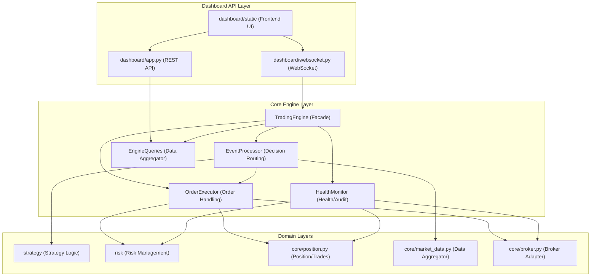

# 策略架構（UltraTrader）

本文件聚焦「策略層 → 風控層 → 下單層 → 持倉/績效 → 監控/自動交易治理」的**完整交易流程**，並把三個核心策略的**停損/停利/最長持倉**規則整理成可維運的架構說明。

> 參考實作：`core/engine/*`、`core/position.py`、`strategy/*`、`risk/*`、`dashboard/app.py`。

---

## 1. 目標 / 範圍 / 不做什麼

### 目標
- 用「架構視角」說清楚：策略如何產生訊號、如何出場、停損停利怎麼落地、最長持倉如何界定。
- 說清楚：從行情事件到下單、持倉更新、績效紀錄、風控狀態持久化、Dashboard 監控的全鏈路。
- 說清楚：自動交易（`auto_trade`）如何治理（ON/OFF、暫停/恢復、熔斷、異常監控）。

### 範圍
- 策略：`strategy/momentum.py`、`strategy/gold_trend.py`、`strategy/mean_reversion.py`（進出場、停損停利、時間停損/持倉上限）
- 風控：`risk/manager.py`、`risk/circuit_breaker.py`、`risk/position_sizing.py`（熔斷、部位大小、盤別限制）
- 交易流程：`core/engine/events.py`、`core/engine/executor.py`、`core/position.py`
- 監控：`core/engine/health.py`、`dashboard/app.py` + WebSocket 推播

### 不做什麼
- 不重新設計策略參數，也不對策略勝率/期望值做結論（文件只描述「現況架構與規則」）。
- 不替換交易框架/券商 API；不改動程式碼行為（本次交付為文件）。

### 主要風險（維運角度）
- **資料品質/延遲**：Tick/KBar 事件延遲、斷線、價格跳點可能導致錯誤停損或錯過出場。
- **狀態不一致**：引擎持倉 vs 券商真實持倉不一致（live 模式尤其重要）。
- **自動交易治理**：`auto_trade=OFF` 仍會掃描訊號但不下單；需避免誤以為「沒訊號」。

---

## 2. 模組架構（Module Architecture）

### 2.1 模組結構圖（依賴方向：上層 → 下層）

### 2.2 Public API（對外穩定介面）
- TradingEngine（`core/engine/__init__.py`）：`initialize()`、`start()`、`stop()`、`pause()`、`resume()`、`toggle_auto_trade()`、`set_risk_profile()`、`get_state()`、`manual_open()`、`manual_close()`
- Dashboard（`dashboard/app.py`）：讀取 state、切換 `auto_trade`、引擎操作（start/pause/resume/stop）、手動開平倉、查詢 trades/kbars/stats 等

---

## 3. 交易訊號契約（Strategy → Engine）

策略輸出統一的 `Signal`（見 `strategy/base.py`），核心欄位用途如下：
- `direction`：`BUY` / `SELL` / `CLOSE`（對應進場/平倉）
- `strength`：訊號強度（用於門檻、也可映射到部分出場比例）
- `stop_loss`：停損價（0 表示不設定；但多數策略會設定）
- `take_profit`：最終兜底停利價（0 表示不設定）
- `take_profit_levels`：分段停利（`[(price, fraction), ...]`，fraction 表示要出掉的比例）
- `reason` / `source`：策略決策原因（會被寫入交易紀錄與 Dashboard 推播）

引擎落地停損/停利的核心依據：
- **Tick 級硬停損**：`core/engine/events.py` 在 `on_tick()` 優先將觸發停損的 tick 送入佇列（urgent），並在後續處理時強制平倉。
- **KBar 級策略出場**：`core/engine/events.py` 在每根 K 棒完成時呼叫 `strategy.check_exit(...)`，讓策略做「分層出場」。

---

## 4. 停損停利邏輯（分層出場：由硬到軟）

### 4.1 全域（不依策略）

1) **盤別強制平倉（收盤前）**
- `core/engine/events.py`：當盤別進入 `SessionPhase.CLOSING` 或距收盤 <= 5 分鐘，會直接 `executor.force_close(...)`。
- 結果：不論策略是否還想持有，收盤前都會被引擎層收斂風險並退出。

2) **熔斷（停止新交易 / 緊急停機）**
- `risk/circuit_breaker.py`：`ACTIVE / COOLDOWN / HALTED / EMERGENCY_STOP`
  - 每日虧損超限 → `HALTED`（當日停機）
  - 連虧達門檻、短時間交易過多 → `COOLDOWN`
  - 單筆異常虧損、連線中斷 → `EMERGENCY_STOP`
- `risk/manager.py` 的 `evaluate(...)`：在最前面檢查 `circuit_breaker.can_trade`，不允許交易就拒絕進場。

3) **下單失敗冷卻（防無限重試）**
- `core/engine/executor.py`：進場/出場都有失敗冷卻與重試上限，避免轟炸券商 API。

### 4.2 策略層出場（以「動量策略」為例：多層防護）

#### A. `strategy/momentum.py`（自適應動量策略）
出場優先序（概念上由「硬」到「軟」，實作上依 `check_exit()` 內的順序）：
1. **固定/自適應停損（第 1 層）**
   - 依 `ATR × stop_loss_multiplier` 設定初始停損，並在 ATR 變化下「只收緊不放寬」。
2. **保本停損（第 1.5 層）**
   - 獲利達門檻後，將停損上移/下移到接近成本（給 buffer 避免被洗）。
3. **Chandelier Exit（第 2 層，追蹤停利）**
   - 利潤夠大後啟動追蹤：LONG 用 `highest_since_entry - N×ATR`，SHORT 用 `lowest_since_entry + N×ATR`。
4. **利潤回吐保護（第 2.5 層）**
   - 若最大未實現獲利夠大，回吐超過比例就直接出場（保護已拿到的利潤）。
5. **分段停利（第 3 層）**
   - 觸發某個 `take_profit_levels` 價位就出掉 fraction 比例（透過 `Signal.strength = fraction` 表達出場比例）。
6. **時間停損（第 4 層）**
   - `bars_since_entry > time_stop_bars` 時：
     - 若仍在虧損 → 出場
     - 若在獲利 → 不強制出場（讓趨勢延伸）
7. **最終停利（兜底）**
   - `take_profit` 觸發則全平（策略可選擇使用或不使用）

#### B. `strategy/gold_trend.py`（黃金趨勢策略）
- 結構與動量策略類似，但參數上更適配黃金特性：
  - 停損倍數上限較高（`stop_loss_multiplier` 可到 7.0）
  - `time_stop_bars` 上限可到 120（黃金趨勢延續更久）
  - 回吐保護容忍度較大（最多回吐 65% 才出）
- 時間停損觸發條件偏「獲利不足」而非純虧損：持倉超時且獲利 < `0.5×ATR` 時出場（避免資金卡在低效率趨勢）

#### C. `strategy/mean_reversion.py`（均值回歸策略）
- 停損：布林帶外側 + ATR buffer
- 停利：回到布林中軌（`take_profit = bb_middle`）
- 時間停損：固定 20 根 K 棒（超時直接出場）

---

## 5. 最長持倉時間（定義與計算）

本系統的「最長持倉」同時受三種機制約束（由強到弱）：

### 5.1 盤別強制平倉（硬上限）
- 引擎層在收盤前（`SessionPhase.CLOSING` 或距收盤 ≤ 5 分鐘）會強制平倉（`core/engine/events.py`）。
- 這是**跨策略**的最硬限制：不讓持倉跨越收盤風險區間。

### 5.2 策略時間停損（軟上限，依策略）
- 動量策略：`AdaptiveParams.time_stop_bars`（預設 60，且被 clamp 在 10~60）
  - 只在「超時且虧損」時觸發出場（獲利不強平）。
- 黃金策略：`GoldAdaptiveParams.time_stop_bars`（範圍 20~120）
  - 超時且「獲利不足」時出場（獲利很好可繼續持有，直到收盤強平或其他出場層觸發）。
- 均值回歸：固定 20 根 K 棒超時出場。

### 5.3 換算成「時間」
- `bars_since_entry` 的時間單位取決於引擎 timeframe（`TradingEngine.timeframe`，預設 1 分 K）。
- 若 `timeframe = 1`：
  - 動量：最多 60 分鐘（但僅虧損時會用時間停損提前出）
  - 黃金：最多 120 分鐘（但仍可能因收盤強平更早出）
  - 均值回歸：20 分鐘

---

## 6. 完整交易流程（端到端）

下面用「事件驅動」方式描述從行情到交易落地的完整流程（對應 `core/engine/events.py` 與 `core/engine/executor.py`）：

### 6.1 行情進入系統（Tick）
1. `Broker` 收到 tick（真實 or 模擬），呼叫 `EventProcessor.on_tick(tick)`
2. 若該商品有持倉且 tick 觸及停損價，該 tick 會被視為 urgent 優先入隊（避免被大量事件淹沒）
3. Event thread 從 `_event_queue` 取出 tick
4. 更新聚合器（價格、K 棒聚合）、更新 orderbook 特徵、更新 `MarketSnapshot`
5. 對持倉中的標的，策略可在 tick 或 KBar 層出場（其中「硬停損」優先）
6. 推播給 Dashboard（tick/snapshot/state 等）

### 6.2 K 棒完成（KBar close）
1. `TickAggregator` 完成一根 K 棒後，呼叫 `EventProcessor.on_kbar_complete(instrument, kbar)`
2. Event thread 取出 kbar event 後：
   - 更新指標（`IndicatorEngine` → `MarketSnapshot`）
   - 更新 MTF（5m/15m）快照（如果資料足夠）
   - 先做「收盤前強制平倉」檢查（若觸發就不跑策略決策）
   - **出場優先**：若有持倉，呼叫 `strategy.check_exit(position, snapshot)`
   - **進場其次**：若無持倉，呼叫 `strategy.on_kbar(kbar, snapshot, snapshot_5m, snapshot_15m)`

### 6.3 進場（Entry → 風控 → 下單 → 開倉記錄）
1. 策略產生 `Signal(BUY/SELL)` 後：
   - 若 `engine.auto_trade == ON`：進入 `OrderExecutor.execute_entry(...)`
   - 若 `engine.auto_trade == OFF`：只廣播 `auto_trade_signal`（前端看到訊號但不會成交）
2. `RiskManager.evaluate(...)`（`risk/manager.py`）：
   - 熔斷/盤別限制（最先）
   - 單筆停損距離合理性（過大拒絕、過小會自動調整到至少 1 ATR）
   - 部位大小計算（依風險檔與點值）
   - 相關性降倉（同方向曝險則降低新倉部位）
3. 放行後由 `Broker.place_order(...)` 真正下單（或 paper 模式直接記錄虛擬倉）
4. `PositionManager.open_position(...)` 記錄持倉（包含 stop_loss/take_profit/levels、策略名、regime、signal_strength）
5. 推播 trade event 給 Dashboard、並寫入績效追蹤（`PerformanceTracker`）

### 6.4 出場（Exit → 平倉下單 → 交易紀錄 → 熔斷統計）
1. 出場來源可能是：
   - 策略 `check_exit(...)`（分層出場）
   - 引擎收盤強平（`force_close`）
   - 硬停損（tick 觸發）
   - 人工手動平倉（Dashboard → `manual_close` → `force_close`）
2. `OrderExecutor.execute_exit(...)`：
   - 根據 `Signal.strength` 決定是否部分出場（分段停利）
   - 下單成功後更新持倉與交易紀錄（`PositionManager.close_position(...)`）
   - 通知 `RiskManager.on_trade_closed(...)` 讓熔斷器更新日內虧損/連虧/交易頻率
   - `risk/persistence.py` 將風控狀態寫入 `data/risk_state.json`（重啟可恢復）
3. 推播 trade close event、更新績效資料

---

## 7. 監控與自動交易治理（Monitoring / AutoTrade）

### 7.1 自動交易總開關（AutoTrade）
- 來源：`TradingEngine.auto_trade`（`core/engine/__init__.py`）
- 行為：
  - ON：策略有 entry signal → `OrderExecutor.execute_entry(...)`
  - OFF：策略仍會掃描，若出現 entry signal → 只推播 `auto_trade_signal`（不會下單）
- 控制面：
  - REST：`dashboard/app.py` 提供 `toggle_auto_trade` 類端點（前端切換）
  - WS：狀態變化會被 `_broadcast("settings"/"state")` 推播

### 7.2 Engine 狀態機（運行/暫停）
- `EngineState`（`core/engine/models.py`）控制引擎是否處於 RUNNING / PAUSED / STOPPED 等狀態。
- `pause()` / `resume()`：
  - 用於暫停「策略決策」而不是停止行情處理（實際行為以 `EventProcessor` 判斷 state 的邏輯為準）。

### 7.3 健康監控（HealthMonitor）
位置：`core/engine/health.py`
- 心跳：由 event loop 週期性呼叫 `tick_heartbeat()` 觸發 `_heartbeat()`（每 60 次約 60 秒）
- 功能：
  - 盤中持倉摘要 log
  - live 模式做「引擎持倉 vs 券商真實持倉」核對（reconcile）
  - 價格異常偵測：短時間偏離 > `5×ATR` 時，觸發 `circuit_breaker.on_connection_lost()` 進入緊急停機（並寫入 halt_reason）

### 7.4 風控監控（Circuit Breaker 可視化）
- `risk/circuit_breaker.py` 的 `to_dict()` 會回傳：
  - state/can_trade/halt_reason/daily_loss/max_daily_loss/consecutive_losses/cooldown_until/近期交易數
- Dashboard 前端會用這些資訊呈現熔斷狀態（例如狀態點燈、文字說明）。

### 7.5 儀表板（Dashboard）
位置：`dashboard/app.py` + `dashboard/static/app/*`
- `GET /api/state`：前端主狀態來源（含 auto_trade、engine_state、risk、positions、snapshot 等）
- WebSocket：推播 `state`、`trade`、`auto_trade_signal` 等事件，讓 UI 不用輪詢即可即時更新

---

## 8. 驗證方式（最小可執行）

若要快速驗證此文件描述與系統一致，建議用以下最小路徑：
1. simulation 或 paper 模式啟動（`scripts/start.py`）
2. 打開 Dashboard：
   - 確認 `engine_state`、`auto_trade` 顯示正確
   - 將 `auto_trade` 切 OFF：確認會收到 `auto_trade_signal` 但不會開倉
   - 切 ON：確認信號進場後產生 `trade` 推播與 position 更新
3. 人工製造出場：
   - 觸發策略停損/停利（或手動平倉），確認 `trade close`、`RiskManager.on_trade_closed()` 被更新（熔斷狀態/日內損益）
4. live 模式（慎用）：
   - 觀察 `HealthMonitor` 的 reconcile log 是否能抓到不一致（不一致應只告警、不自動做破壞性修正）

